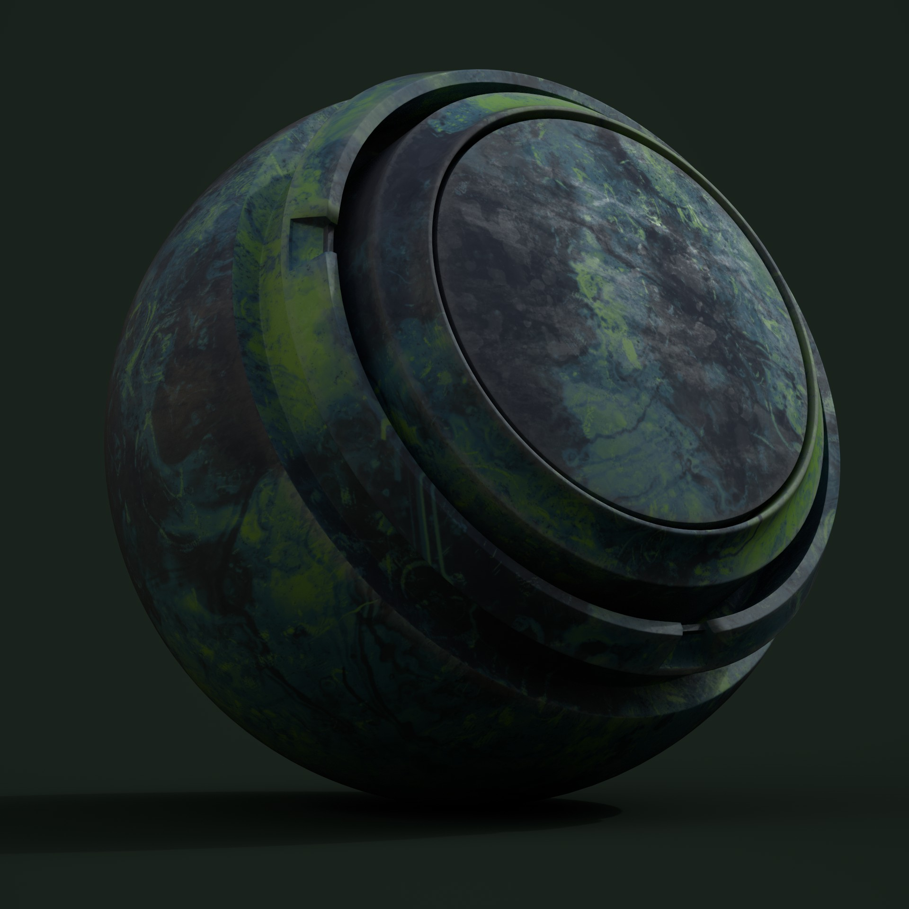

# Helpfull extras

Here I will be talking about i i created this material with only the tools substance provides you with, and i used some techniques i havent meantioned in the previous substance tutorial.

## Setup:

Under Files there is a tab called open samples. The one called basic sphere is the one you want to use to get this sphere here.&#x20;

This Project is in a different template so you will have to go into your texture set settings to change the channels accordingly and also open your shader settings all the way on the right to edit your project template.&#x20;

.png>)

.png>)

.png>)

Now if all you have seen of substance so far is my last guide this might get a bit more complicated then that altho i do not think that its to bad, either way thats just your friendly dissclaimer.

## The Material:

I created a fill layer and added a grunge map 014 directly into their gloss and diff channels with identical settings for all of them.&#x20;

.png>)

Now onto that layer i also directly added a gradient filter, these are again added by going into the effects dropdown, selecting filter, and then searching for the one called gradient.&#x20;

.png>)

This is what it looks like, and its function is pretty simple yet really handy. As you can see i have its channel set to diffuse. and since i have the grunge map in the filllayers diffuse layer, I am able to asign different colors to different levels of luminocity on that diffuse and they are interpolated between. So as you can see in the screenshot i have increased the color quantity to 4, then I assigned a really dark blue to the black value, then a lighter blue and an even lighter one up to 0.5 and then for the reast I set it to a nice green.

Here is a before and after.

.png>)

.png>)

To this fill layer i now added a levels adjustment filter to bring its glossiness back to something reasonable. When you work with levels outside of masks you need to set the affected channel in a dropdown.&#x20;

.png>)

.png>)

You could now add a slight blur aswell if you find the details to be to harsh.

Now ontop of this layer i added one with only a gloss channel and a valuje of around 0.58 for it.

After that i added a mask to this layer.

.png>)

.png>)

As you can see this is already creating more intersting patterns in the roughness.

Now i basically duplicated that layer and hardly changed its gloss at all and in the mask i only applied a grunge 004 map witha  scale of 3.5.

.png>)

Now ontop of this i added a fill layer with grunge dirt splats as its gloss input.

.png>)

I went into the glossines channel on my layer stack.

.png>)

And i set the layer to soft light here.&#x20;

.png>)

Now this has a really nice way of taking brighness away from what i had before to create additional breakup and i also reduced it with a levels on gloss again.

.png>)

.png>)

Now i started to create some edgewear. So i started off by making a new layer with a gloss of .15.

And in the black mask of this i added a generator and selected curvature for it.

.png>)

Ontop of this I added a fill layer with a simplex noise 3d for its input in the greyscale and i set it to multiply. &#x20;

.png>)

The effect this has it that its randomly reducing the strength of the curvature map so its less uniform around all edges.

Only curvature.

.png>)

Simplex noise on multiply.

.png>)

I added a blur slope for additional breakup.

.png>)

And then some warp ontop of it.

.png>)

Then i added another fill effect with grunge scratches for its greyscale and i also set it to multiply.

.png>)

.png>)

While the direct comparison between the two looks of edgewear and no edgewear arent to noticable edgewearr is just the kind of thing that looks wrong when its missing. However to get it a bit more visually interesting i decided to add some discoloration to the plastic around these damaged edges.

So what i did for that is duplicate my base layer right underneath the one i was just working on and i copie pasted the edge wear mask on it.&#x20;

Then to the fill layer i applied a HSL perceptive filter.

&#x20;

.png>)

This is what I used to create the discoloration.

.png>)

Now the last step I took is adding some subtle dirt or dust.

So I created a new fill layer all the way at the top of the layerstack, added a grunge rough dirty to its diffuse and i applied this gradient to it.

.png>)

I also added a HSL perceptive to this to have some easyer control over the color of the dirt. With it I lowered its lightness slightly and lowered its saturation a lot.

The mask for it is a simple AO generator with the same simplex noise multiply and a blur as well as a blur slope on top of it.&#x20;

.png>)

.png>)

## Conclusion:

As you can probably see this way of creating your details is alot less clutered in your layerstack compared to the marble guide. Creating something that looks as unique as the color of this material would also be pretty hard without gradients. So both ways are viable. you should just know what to do when and how.&#x20;

Me calling these guides ways of doing things is also a bit of a stretch, there is no real border or distinction, i just used some different methods here that also require a bit more familiarity with substance.
