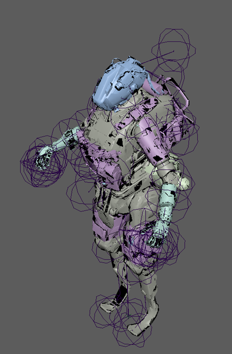

# Pilot editing

## Stim setup:

Getting the Model from the Github I imported it into Maya, once again the software you use doesnt matter.

So, time to explain what’s going on here. Those spheres described by 3 circles are the joints of the models bones, I’m not animating these so ill delete them, instead of clicking every joint individually your program has some sort of hierarchy in which you can select the entire rig.

.png>)

And here you can already see the next issue, ever LOD of the model is included. LOD stands for level of detail and they are lower resolution versions of the model that are switched to depending on the observers distance to the object. This saves performance. You can also force your game to only display the lowest resolution version of these to save performance, you would do this with a custom video config, there’s guides for this online.

The bottom one of the list is the pilots body and the name ends in lod0, this and the fact that it has the highest polycount means that it’s the correct model to work with. Don’t use any other version for texturing, that will cause things to not align correctly anymore and there is just not reason to do so in general.

I also delete the head as I’m only focusing on arm right now.

Now I do not know if this next thing will be the same in other software or if it is Maya specific. Although since I just imported an fbx it seems likely that it would be universal.

Now I go into face selection mode and delete everything that is not the arms. Useful tip is that the specific parts of the model all have different colours already assigned to them based on their Udim.

The arms are a separate on which makes it really easy to know which parts belong and which parts don’t.

.png>)

Here you can see what I am talking about. Delete everything that doesn’t have the arms teal colour, even if it seems to be a part of the arm, if you don’t do so the UVs will overlap.

With this done what I would do is scale the arms down to a more reasonable size as they are, to put it lightly, FUCKING HUGE.

&#x20;This doesn’t work as you can see here by the move tools axis being greyed out. So I am unable to affect the objects transforms.

.png>)

How I work around this is by duplicating all the guns geometry which makes them separate and unaffected by this. Yes I do not know an actual fix and neither did my Teacher for Maya so yikes ig.

.png>)

This has caused every part of the gun that isn’t physically connected to become a separate model, but all the way at the bottom of my outliner I can see that there is one that is all of them combined together again.

.png>)

You might have to make you objects one again by hand but that is also as simple as selecting all of them and then combining them with what ever that function is called in your program.

Now I scaled it down to a size I liked more and placed it in the middle of my scene.

That was everything I needed to do here so I export this now and go into substance painter. You should compare your UVs to see if you have missed anything just in case.

.png>)

These are all parts that should be included in your UV layout, if something is missing go back and don’t delete it this time and if something is too much delete it.

And getting rid of the bones is not necessary, just once again tis best to work as cleanly as possible to avoid additional problems being caused.

### Substance part:

These arms don’t have an emission channel in game so adding them in substance is pointless.

.png>)

After baking one arms AO is quite fucked which is due to the arms asymmetry. This is something you can thank Respawn for.

.png>)

The easiest way to fix this is by just using the base games AO map which I would recommend anyways so your skin will fix with the games general aesthetics. Yes the AO substance exports isn’t at all the same as the basegames.

.png>)

Scroll down in the Texture settings to find all your mesh maps and here you can just click the x next to Ambient occlusion.

That’s all you need to keep in mind in this case.

